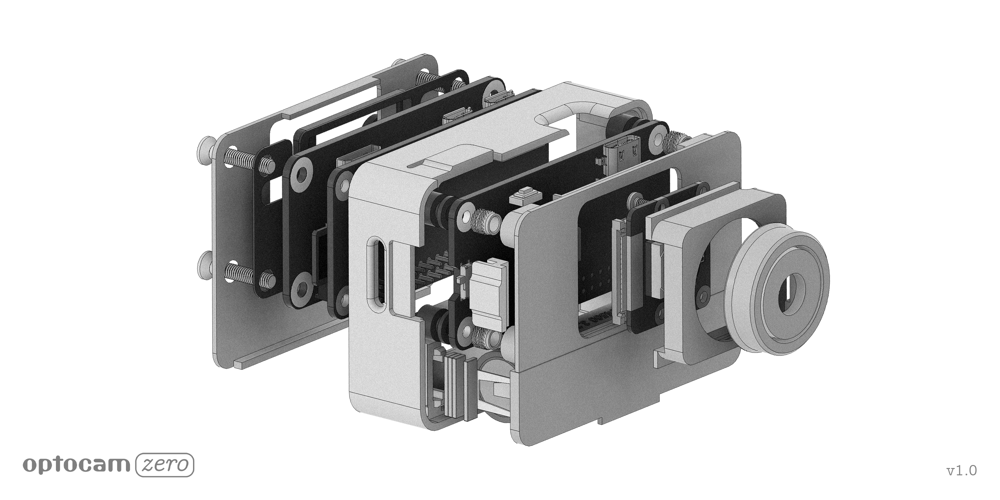

# Optocam Zero V1.0

Optocam Zero is a Raspberry Pi Zero based compact digital camera made using off the shelf components.

 

## Features
- Very compact and easy to carry in your pocket.
- Intuitive and simple camera interface and controls.
- Autofocus camera.
- Customizable color temperature.
- Easy and fast image transfer through custom hotspot interface. Optimized both for mobile and desktop.
- Screen dimming when inactive to preserve battery.
- USB-C charging. Device can be used while charging.
- Interchangable battery.
- Off the shelf / common components for the electronics.
- Fully 3D printed case parts (apart from fasteners).
- 3D printable TPU protective sleeve and lanyard design is available.

 

## Specs

- 6 unique image filters included.
- 2592x2592px Jpeg image capture. Image saves in the background while preview stays active.
- 240x240px 1.4 inch lcd display.
- Consistent 15–20 fps camera preview on the screen.
- 22 seconds boot time.
- Uses 14500 type li-ion battery.
- 70–80 minutes of use per charge.
- Dimensions: 51×71×18mm (excluding camera and screen bump)
  
 

## What's Included
- Ready to print Bambu Studio project file available for transparent PETG or PETG / PETG-CF printing.
- Detailed and accurate CAD file is made available for easy customization.
- One command camera software installer for Raspberry Pi OS Bookworm.

 

## Hardware

See the [hardware](hardware/) folder for CAD files, STL files, BOM, and print-ready files.

 

## Software

See the [software](software/) folder for the installation guide and software installer.
